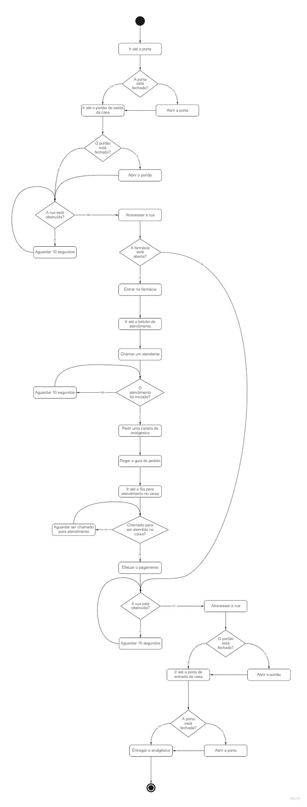

# Lógica de programação

No primeiro vídeo da série eu abordei lógica de programação, exemplificando com instruções para um robô ir na farmácia comprar um analgésico.

## Material de apoio

* [Vídeo](https://www.youtube.com/watch?v=ZKcHT-paLnw)
* [Instruções](./robo-farmacia-instrucoes.txt)
* [Fluxograma no Miro](https://miro.com/app/board/o9J_lmrx184=/?invite_link_id=206812260574)

